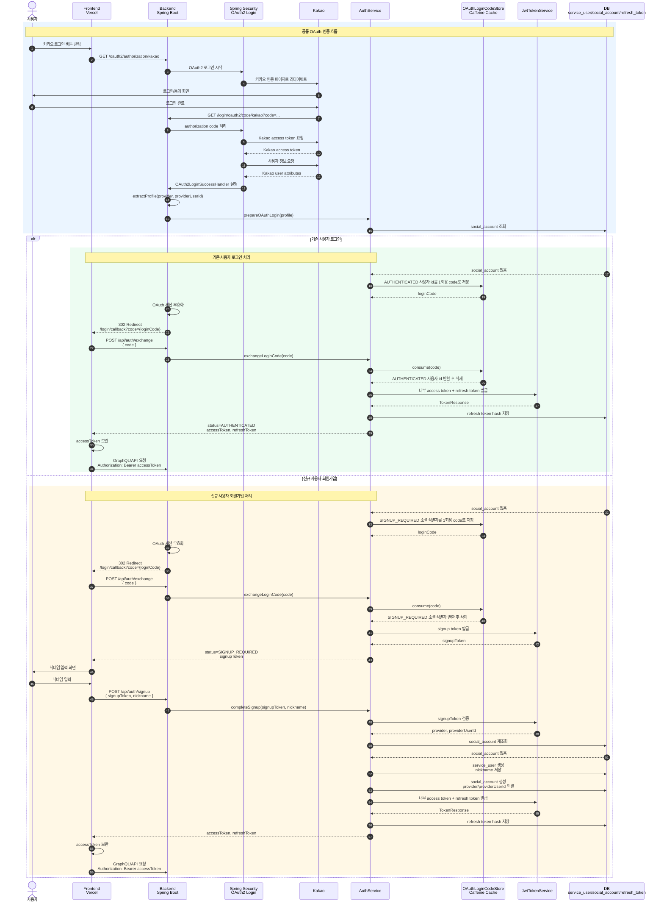

# 소셜 로그인 연동

## 로그인 흐름

1. 프론트에서 백엔드의 `GET /oauth2/authorization/kakao`로 이동한다.
2. 카카오 인증이 끝나면 백엔드는 프론트의 `/login/callback?code=...`으로 리다이렉트한다.
3. 프론트는 받은 1회용 코드를 `POST /api/auth/exchange`로 교환한다.
4. 백엔드는 교환 시점에 `AUTHENTICATED`이면 앱 access/refresh token을 발급한다.
5. 백엔드는 교환 시점에 `SIGNUP_REQUIRED`이면 signup token을 발급한다.
6. `SIGNUP_REQUIRED`이면 사용자가 닉네임을 직접 입력한 뒤 `POST /api/auth/signup`을 호출한다.

카카오가 반환한 닉네임은 회원가입 닉네임으로 사용하지 않는다. 신규 사용자는 반드시 서비스에서 닉네임을 직접 입력해야 한다.

## 인증 흐름 다이어그램



## API

### 로그인 코드 교환

```http
POST /api/auth/exchange
Content-Type: application/json

{"code":"one-time-login-code"}
```

기존 회원 응답:

```json
{
  "status": "AUTHENTICATED",
  "tokens": {
    "accessToken": "...",
    "refreshToken": "...",
    "tokenType": "Bearer",
    "accessTokenExpiresIn": 1800
  },
  "signupToken": null
}
```

신규 회원 응답:

```json
{
  "status": "SIGNUP_REQUIRED",
  "tokens": null,
  "signupToken": "..."
}
```

### 회원가입 완료

```http
POST /api/auth/signup
Content-Type: application/json

{"signupToken":"...","nickname":"직접 입력한 닉네임"}
```

### 토큰 재발급

```http
POST /api/auth/refresh
Content-Type: application/json

{"refreshToken":"..."}
```

재발급할 때 access token과 refresh token이 모두 새로 발급된다. 사용한 refresh token은 즉시 폐기된다.

### 로그아웃

```http
POST /api/auth/logout
Content-Type: application/json

{"refreshToken":"..."}
```

성공 시 `204 No Content`를 반환한다.

### 인증 API 호출

GraphQL을 포함한 보호 API에는 access token을 전송한다.

```http
Authorization: Bearer <accessToken>
```

## 환경변수

| 이름 | 용도 |
| --- | --- |
| `KAKAO_CLIENT_ID` | 카카오 REST API 키 |
| `KAKAO_CLIENT_SECRET` | 카카오 로그인 클라이언트 시크릿 |
| `JWT_SECRET` | 내부 JWT 서명 비밀키. 운영에서는 충분히 긴 임의 값 사용 |
| `FRONTEND_LOGIN_CALLBACK_URL` | 로그인 결과를 받을 프론트 URL |
| `CORS_ALLOWED_ORIGINS` | 쉼표로 구분한 허용 프론트 origin 목록 |

카카오 디벨로퍼스에는 `{백엔드 주소}/login/oauth2/code/kakao`를 Redirect URI로 등록한다. 프록시 뒤에서 실행할 때도 외부 요청의 scheme과 host가 유지되도록 forwarded header 설정이 적용되어 있다.

## 토큰 만료 시간

| 토큰 | 만료 시간 |
| --- | --- |
| access token | 30분 |
| refresh token | 14일 |
| signup token | 10분 |
| 로그인 교환 코드 | 2분, 1회 사용 |
